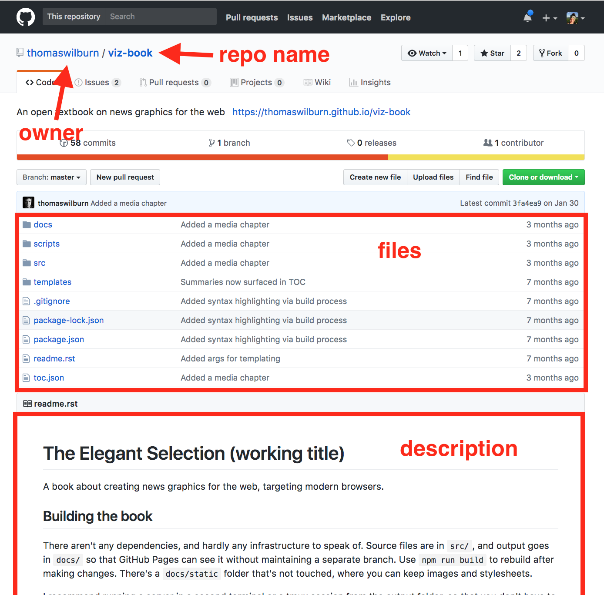

## What is GitHub? 
GitHub is a website that is used for project management. It is used by pointing and clicking on buttons because it is a graphical user interface (GUI). 

It hosts repositories, each of which is a collection of files associated with a particular project. GitHub contains hundreds (thousands?) of repositories. While many of these projects are for software development, GitHub can be used for many types of projects, from websites to scientific journal articles to open textbooks. 

GitHub enables diverse project management tasks, including but not limited to: 
- Working simultaneously on a single file with multiple collaborators
- Storing all project-related files together
- Sharing project content and outputs publicly
- Organizing to-do lists and project tasks
- Keeping track of all changes to files and who made them
- Reusing content created by others

Repositories can be public or private. Public repos can be viewed by anyone on the web, while private repositories are only seen by those with permissions to see them. Private repos cost money, but can get unlimited free private repositories with a .edu email address. 

## Examples of using GitHub in library context

Teams are not the only ones to benefit from version control: lone librarians can benefit immensely. Version control is much like provenance - you know which changes came from who, and when. Future you will be pleased there's a record of events to come back too. There are many examples of information professionals using git in their everyday work to make sure they have a record of changes. Consider these common library world scenarios!

#### Scenario 1: Local librarian looking to start a crowdsourcing project

A local librarian is looking to put thousands of historical photographs of the area online so that the community can help identify the people and places they depict. She combs the web for examples of existing crowdsourcing projects, and even though they all appear unique to each institution, she notices quite a few seem to have almost the exact same functionality and structure. Rather than build a whole new version from scratch herself, she wishes there was a way to just copy the code of an existing one, and modify it to reflect her project. She notices the GitHub icon at the bottom of one of the projects she likes, but clicking on the link just brings her to a confusing directory of files and oddly labeled buttons such as "Fork".  

> GitHub hosts open-licensed projects ... and allows any user to fork any public project. By clicking the "fork" button, any GitHub user can almost instantaneously create their own version of an existing project. That "forked" project can be used as the basis for a new project, or can be used to work out new features that can be merged back into the original. (From: [GitHub for Academics](http://www.digitalpedagogylab.com/hybridped/push-pull-fork-github-for-academics/) )

#### Scenario 2: Multiple librarians editing metadata for a collection

A librarian has exported a spreadsheet of metadata from a repository for cleaning and editing. She's working with a group of librarians and students, so they need to make sure edits don't conflict. They also need to be able to undo any edits and preserve the original metadata. Once edits are complete, the whole group wants to review the changes before re-ingesting the spreadsheet of metadata into the repository.

The team can choose to use Git by itself to track changes and resolve conflicts or they can choose to use GitHub to host the project so that users can collaborate and review changes on the Web. Git will preserve the original metadata as well as all edits. GitHub will facilitate discussion about what changes should be made, who should make them, and why.

> A great example of this is in the geoblacklight community. You can browse the GitHub organization, click on a repository (which corresponds to an institution) and view their metadata and its' change over time: [github.com/OpenGeoMetadata](https://github.com/OpenGeoMetadata).

#### Scenario 3: GitHub, small teams, and DAMs
You manage a small library that used GitHub to clone certain aspects of your digital asset management system using a larger library's system. However, a few months later, you realized there were certain glitches that you wanted to address. Using git will allow you to trace back to what went wrong and when (since all edits are recorded). Since git keeps all changes, you can also trace the initial creator of the digital asset management system that you created and reach out to them for feedback.

## Walkthrough of a GitHub repository
[This should be replaced with a more library-relevant example later]

Navigate to [the main page](https://github.com/thomaswilburn/viz-book) of the GitHub repo for an open textbook. It shows the GitHub name for the owner (“thomaswilburn”), the name of the repo (“viz-book”) and a description of the project at the bottom. All of the project files are in the middle, including files in subfolders such as “docs”. 

The files for this project are actually used to create a website for the textbook, with the link for it at the top of the page. 

## Examples of GitHub repositories

Open Data

+ Congressional data: [https://github.com/unitedstates/congress-legislators](https://github.com/unitedstates/congress-legislators)
+ Global data: [https://github.com/openaddresses/openaddresses](https://github.com/openaddresses/openaddresses)
+ Data Catalog: [https://github.com/nyuhsl/data-catalog](https://github.com/nyuhsl/data-catalog)

Dissertation Writing

+ EX1
+ EX2
+ EX3

Sharing metadata

+ EX1
+ EX2
+ EX3

Building a website

+ EX1
+ EX2
+ EX3

Random interesting stuff

+ EX1
+ EX2
+ EX3
