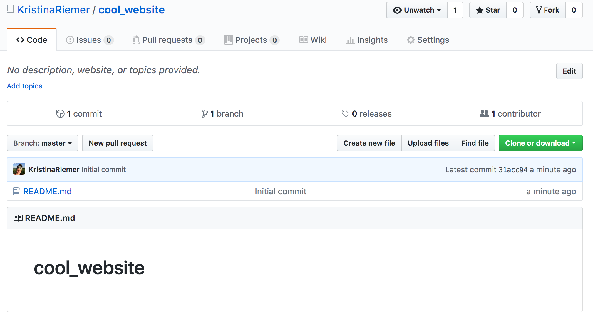
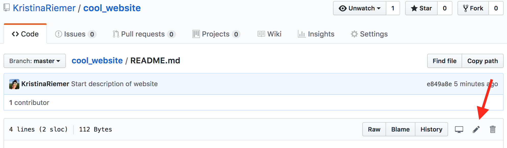

### Create a new repository
You can create a new repository in GitHub. First sign into your GitHub account (after creating one if you haven’t already). Click on plus icon in upper right hand corner and select “New repository”. 

On “Create a new repository” page, make sure you’re shown as the owner. Next to that, type in a repository name. We’ll call this repo “cool_website”. You can type in a description below that of the project the repo is for. Keep this repo set to public, select the checkbox next to “Initialize this repository with a README”, and then hit the green “Create repository” button. 

This will send you to the main page for your new GitHub repo. By selecting the README option, GitHub automatically creates the first file in your repository. It’s a plain text file called README.md. This is specifically a file type called markdown, which we’ll talk about more later. 

Congrats! You’ve created your first GitHub repository. 

### Track changes to file with version control

The contents of the README file are automatically displayed at the bottom of the main page of the repository. The purpose of these files is to describe the project, and oftentimes the files within the repository. 

Currently the README contains just the name of the repository, which isn’t very helpful. Let’s change the README by clicking on the file and selecting the edit button, which is on the right side of the file page and looks like a pencil. 

Delete what is currently there and type in a description. 

One of the things that GitHub can do is track the changes you make to files. This is called version control. Later on you can see what changes you made, who made them, and go back to previous changes if desired. This builds up a record of what has been done in a project. 

Though version control is usually associated with software development, it is increasingly being used for all kinds of files across research and academic collaborations. 

Because we are changing a file, we want to track that change. Once we’re happy with our README description, in the box below “Commit changes” at the bottom of the screen, type in a brief description of what has been done, e.g., “Start description of website”. This is referred to as a commit message. 

Click on the green “Commit changes” button at the bottom. You’ve now created what is referred to as a commit, which is a set of changes to a file or files that has an associated commit message detailing what those changes are. 

If you go back to the main page for your GitHub repository, you can see your commits by clicking on the “2 commits” button in the upper left. Displayed is the commit you just made and the automatically generated first commit from creating the repo. You can see who made the commit (you) and when it was made. If you click on the commit message, you can see exactly what changes were made, with deleted lines in red and added lines in green. 

As you make changes and commit them, the list of commits will get longer, with all commits displayed in reverse chronological order. 
